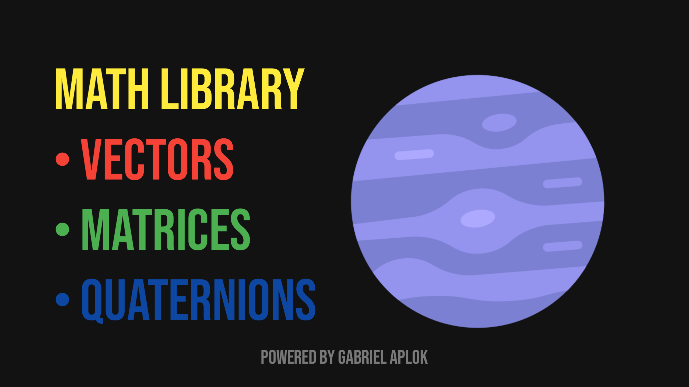

# Math Library


<div align="center">
  <br>
  <br>
  <br>
  <br>
  <br />
  
</div>

A **Math Library** é uma biblioteca de matemática baseada em Java, mas é muito básica.

A biblioteca suporta entidades usadas com mais frequência no desenvolvimento de jogos 3D, ou seja, `vetores`, `matrizes` e `quatérnios`.

### Como usar

1. Adicione o repositório JitPack ao arquivo de compilação do projeto, ou seja, adicione-o na raiz `build.gradle` no final dos repositórios

```groovy
allprojects {
    repositories {
        ...
        maven { url 'https://jitpack.io' }
    }
}
```

2. Adicione a dependência

```groovy
dependencies {
    implementation 'com.github.gabriel-aplok:math-library-android:v0.0.1'
}
```

3. Sincronize arquivos Gradle no Android Studio, ou seja, clique em `Arquivo` > `Sincronizar projeto com arquivos Gradle`

Prontinho!

### Mudanças

- v0.0.1
> - Adicionado suporte para `álgebra linear`:
> - - Adicionado `Vector2`, `Vector3` e `Vector4`.
> - - Adicionado `Matrix`.
> - - Adicionado `Quaternion`.


### Licença
> O Math Library é licenciado sob [MIT License](https://choosealicense.com/licenses/mit/), o que significa que você pode usá-lo gratuitamente, sem restrições em projetos comerciais e não comerciais. Eu, no entanto, adoro receber crédito (não obrigatório) caso você lance um jogo ou aplicativo usando o ECS!

```
MIT License

Copyright (c) 2022 Gabriel Aplok

Permission is hereby granted, free of charge, to any person obtaining a copy
of this software and associated documentation files (the "Software"), to deal
in the Software without restriction, including without limitation the rights
to use, copy, modify, merge, publish, distribute, sublicense, and/or sell
copies of the Software, and to permit persons to whom the Software is
furnished to do so, subject to the following conditions:

The above copyright notice and this permission notice shall be included in all
copies or substantial portions of the Software.

THE SOFTWARE IS PROVIDED "AS IS", WITHOUT WARRANTY OF ANY KIND, EXPRESS OR
IMPLIED, INCLUDING BUT NOT LIMITED TO THE WARRANTIES OF MERCHANTABILITY,
FITNESS FOR A PARTICULAR PURPOSE AND NONINFRINGEMENT. IN NO EVENT SHALL THE
AUTHORS OR COPYRIGHT HOLDERS BE LIABLE FOR ANY CLAIM, DAMAGES OR OTHER
LIABILITY, WHETHER IN AN ACTION OF CONTRACT, TORT OR OTHERWISE, ARISING FROM,
OUT OF OR IN CONNECTION WITH THE SOFTWARE OR THE USE OR OTHER DEALINGS IN THE
SOFTWARE.
```
